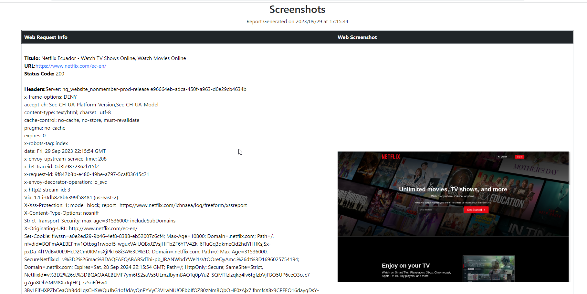

# Script de Capturas de Pantalla e Información de Sitios Web

Este script en Python se encarga de tomar capturas de pantalla de sitios web especificados y recopilar información relevante de ellos. Es útil para generar informes o supervisar el estado de múltiples sitios web de manera automatizada.

## Características Principales:

- **Capturas de Pantalla:** El script utiliza Selenium, un navegador web automatizado, para cargar los sitios web y tomar capturas de pantalla de sus páginas. Puede personalizarse para tomar capturas de pantalla de páginas específicas o realizar un seguimiento completo del sitio.

- **Información del Sitio:** Además de las capturas de pantalla, el script recopila información importante de los sitios web, como el título de la página, la URL, el código de estado de la respuesta HTTP y los encabezados HTTP.

- **Flexibilidad:** Puedes configurar fácilmente el script para supervisar una lista de sitios web diferentes. Es útil para verificar el estado y el aspecto visual de tus sitios web o de los sitios web de tus competidores.

## Requisitos:

- Python 3.x
- Bibliotecas Python como Selenium, Requests y Beautiful Soup para la automatización y el análisis web.

```bash
pip install -r requirements.txt
```

## Uso:

1. Configura la lista de sitios web que deseas supervisar en el script.
2. Ejecuta el script.
3. Los resultados se almacenan en el directorio WebScreen por defecto


```python
python3 webscreen.py -u url          #simple url  https://example.com
python3 webscreen.py -f urls_file    #file with urls, one per line
```

## Resultados:




## Tareas Pendientes (To-Do)

- [x] Soporte Chrome.
- [x] Compatible python3.x
- [X] Funciones multi url
- [X] Renombrar directorios


